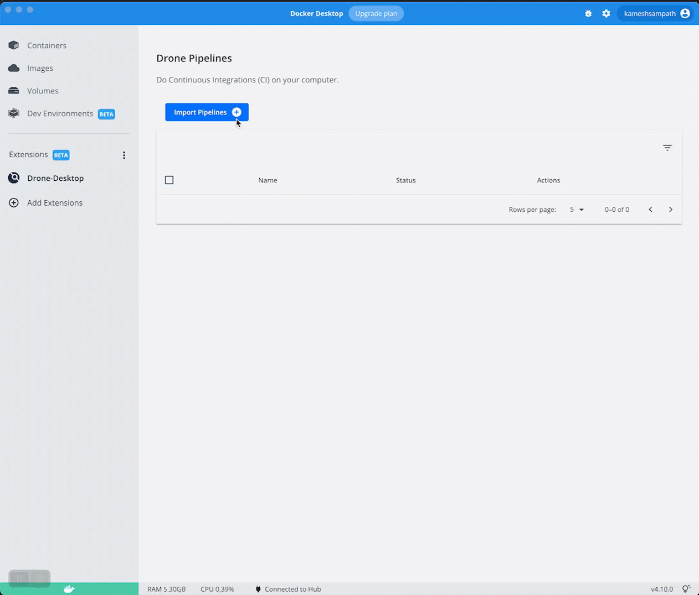
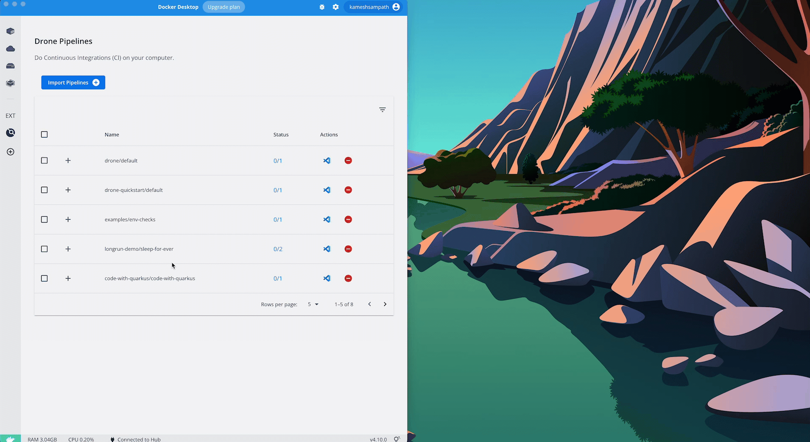
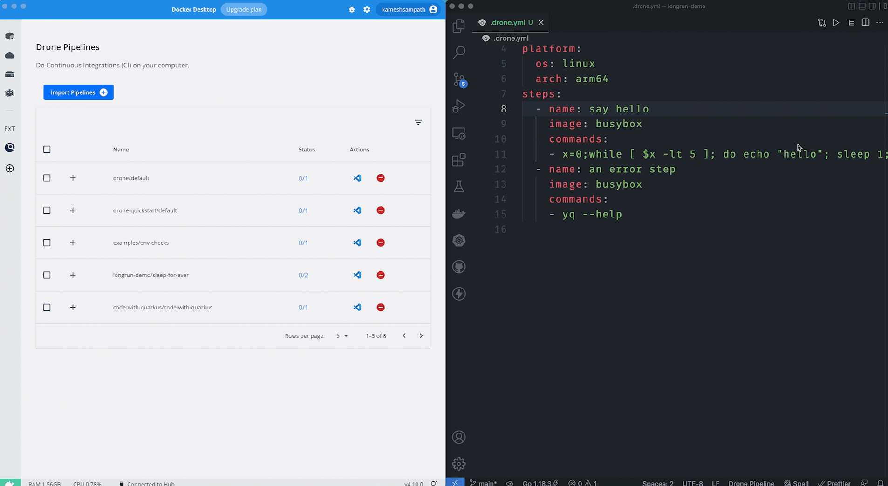
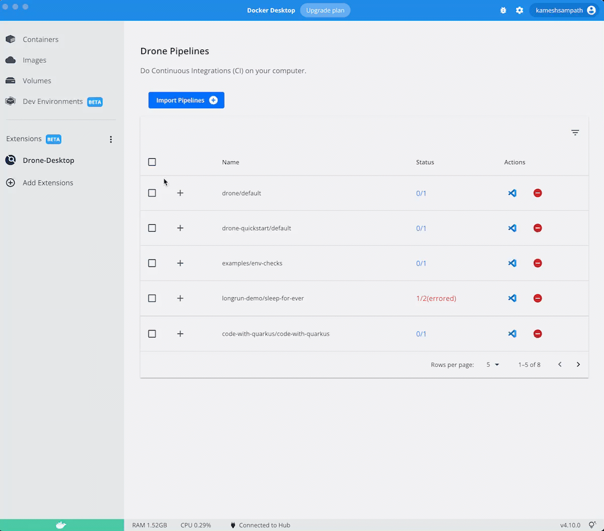

# Drone Desktop

A [Docker Desktop Extension](https://docs.docker.com/desktop/extensions/) to run and manage [drone pipelines](https://docs.drone.io/pipeline/overview/).

> WARNING: This extension is under active development and expect to undergo lots of change and refactoring

## Pre-requisites

- [Docker Desktop](https://www.docker.com/products/docker-desktop/)

## Features

### Discover Drone Pipelines

Search and import existing Drone Pipelines, ideally these are project source folders that has `.drone.yml`:



### Open Drone pipeline project in Visual Studio Code

It's easy to open your Drone Pipeline project in Visual Studio Code directly from the extension within Docker Desktop



### View Running Pipeline Containers

The extension displays your pipeline and the status of each running pipeline container/plugins.



### Remove Pipelines

You can remove one or more Drone pipelines, removing does not physically delete but the pipeline is ignored by the extension watchers.



## TODO

- [ ] [View Logs](https://github.com/kameshsampath/drone-desktop-docker-extension/issues/1)
- [ ] [Exec into running container](https://github.com/kameshsampath/drone-desktop-docker-extension/issues/2)
- [ ] [Use database for backend over JSON file](https://github.com/kameshsampath/drone-desktop-docker-extension/issues/3)

## Install Extension

```shell
docker volume create drone-desktop-data
docker extension install kameshsampath/drone-desktop-extension:v1.0.2
```

## Remove Extension

```shell
make uninstall-extension
```

## Issues

We welcome your feedback and improvements. Please open an [issue](https://github.com/kameshsampath/drone-desktop-docker-extension/issues) for any bugs, feature requests

## Disclaimer

This is not an officially supported Harness product.
